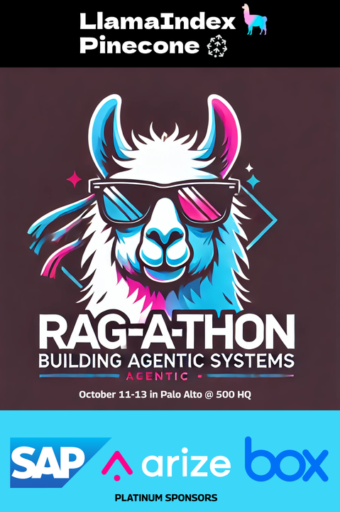
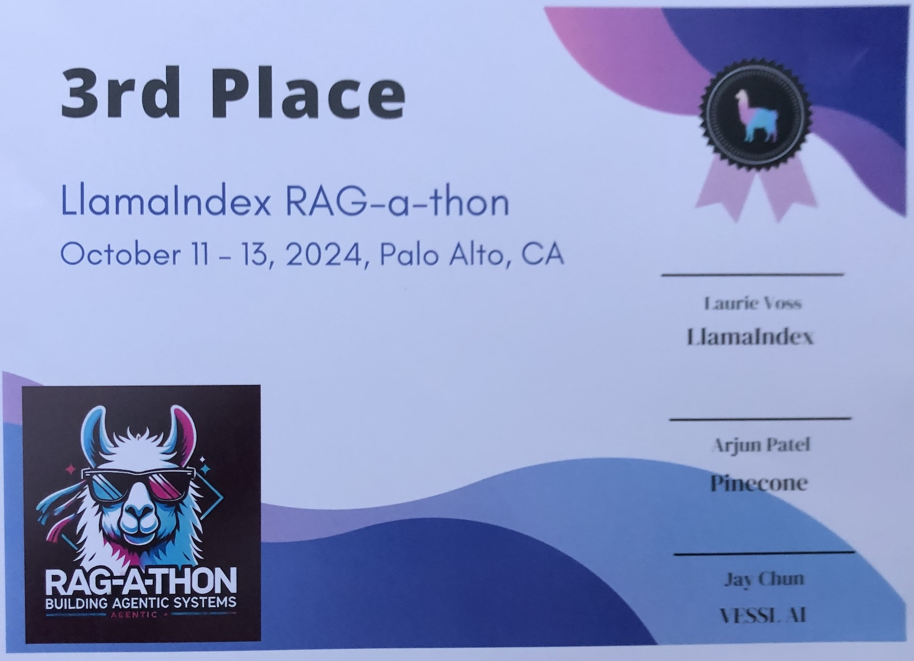
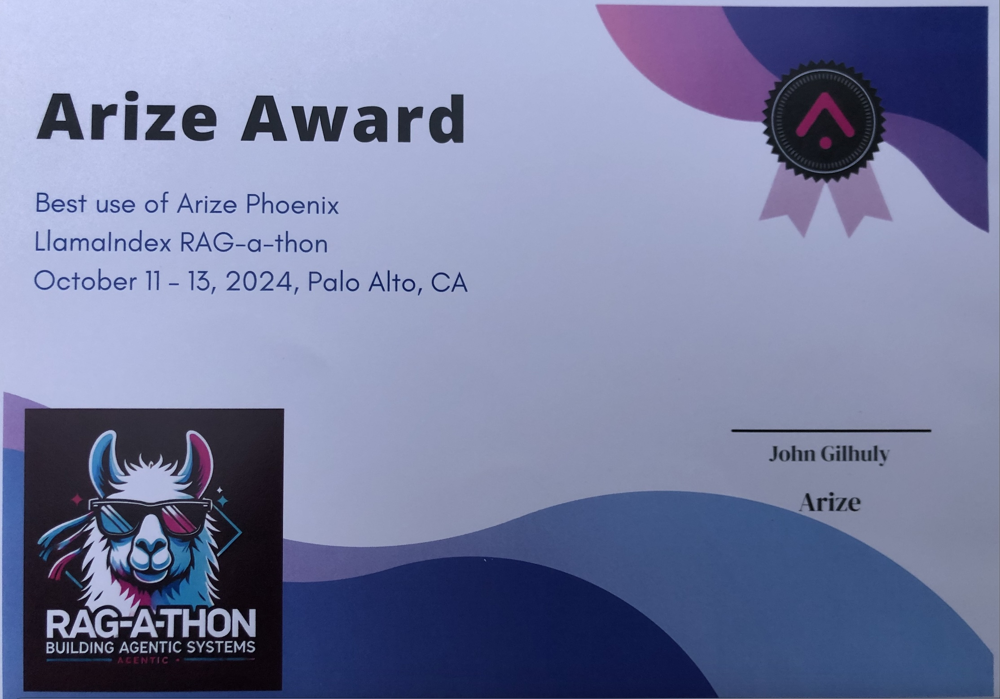

<div align="center">
  
</div><br />
<div align="center">
  
</div>

<!---
0xjdavis/0xjdavis is a ✨ special ✨ repository because its `README.md` (this file) appears on your GitHub profile.
You can click the Preview link to take a look at your changes.
--->
# AI Product Design Engineer for Hire!

[](https://pypi.org/project/me/)

<a href="ocean2.mp4" target="_blank"></a><br />
> &#x1F525; **Generated with AI!** <br />
> *View more of my AI Artwork <a href="https://pitch.com/v/ai-artwork-by-jeff-davis-cwbqy7" target="_blank">here</a> and at <a href="https://shots.jdavis.xyz" target="_blank">shots.jdavis.xyz</a>. You can find Web3 projects at <a href="https://jdavis.xyz" target="_blank">jdavis.xyz</a>.*

## Table of Contents
1. <a href="#welcome">Welcome</a>
2. <a href="#installation">Installation</a>
3. <a href="#documentation">Documentation</a>
4. <a href="#pet-projects">Pet Projects</a>
5. <a href="#miscellaneous">Miscellaneous</a>
6. <a href="#requirements">Requirements</a>
<br />

## Welcome! 
My name is Jeff and you have stumbled upon a wonderful space where I share artificially intelligent things I have designed, built & shipped. That includes data analysis, machine learning, and natural language processing as well as a few pet projects.<br />
<br />
I am constantly pushing the boundaries of generative AI, focusing on creating more human-centric, ethical, and transformative applications that can reshape industries and enhance user experiences across multiple sectors.<br />
<br />
I combine a deep technical AI expertise with a strong background in creative direction and user experience design bringing a holistic approach to AI development, creating solutions that are not only technically advanced but also intuitive, engaging, and aligned with users needs and business objectives.<br />
<br />
I want to change people's everyday lives for the better.<br />
<br />

### Recent AI Innovation Achievement
<table><tr><td border="0" valign="top" width="200" >
<a href="https://rag-a-thon-2.devpost.com" target="_blank"></a><br />
<br />
<br />
</td>
<td valign="top">
<b><a href="https://rag-a-thon-2.devpost.com" target="_blank">LlamaIndex Agentic RAG-a-thon with Pinecone and VESSL AI</a></b> [^1][^2]<br />
<b>500 Global HQ - Palo Alto, Ca<br />
2024</b><br /><br />
<b>🥉 3rd Place Winner</b><br />
Won Third Place at a 48 hour hackathon in the heart of Silicon Valley with 40+ projects by 500+ world class hackers. My project, “OilyRAGs”, is a catalog of multimodal Retrieval Augmented Generation (RAG) chatbots that automate tasks, optimizes operations, and helps diagnose mechanical issues utilizing AI and machine learning. I designed, built, and pitched the project which was coded in Python using Streamlit, LlamaIndex, Pinecone and OpenAI GPT, Whisper, and Vision models.<br /><br />
<b>🏆 Best use of Arize AI Phoenix</b><br />
A secondary project which was submitted by a team I worked with over the course of the weekend also was awarded by Arize Ai for "Best use of Arize AI Phoenix". “OpsRocket” offers high-quality business operations analysis and execution that helps any businesses improve revenue, cut costs, and reduce risks faster than humanly possible.<br />
<br />
<b>Footnotes</b><br />
[^1]: <a href="https://rag-a-thon-2.devpost.com/project-gallery" target="_blank">
  https://rag-a-thon-2.devpost.com/project-gallery
</a><br />
[^2]: <a href="https://www.llamaindex.ai/blog/agentic-rag-a-thon-2-winners-and-recap" target="_blank">
  https://www.llamaindex.ai/blog/agentic-rag-a-thon-2-winners-and-recap
</a><br />
[^3]: <a href="https://www.llamaindex.ai/blog/oilyrags-building-a-rag-powered-mechanic-assistant-with-ai" target="_blank">
  https://www.llamaindex.ai/blog/oilyrags-building-a-rag-powered-mechanic-assistant-with-ai
</a><br />
</td></tr></table>
<br />

### Areas of Focus
- AI/ML Integration in Digital Products
- Generative AI Research & Development
- Rapid AI Product Fit Prototyping
- Multimodal Chatbot Development<br />
<br />
  
### Skills
Years of experience in both user research and human-computer interaction have enabled me to be extremely proficient with most creative, documentation, and prototyping applications and services. I am also a skilled engineer with broad exposure and experience designing, prototyping, and developing complex workflows, multimodal chatbots, and generative AI applications.<br />
<br />
Here is a general list of tools that I am proficient with:<br />
Adobe CC (After Effects, Firefly, Illustrator, InDesign, Photoshop, Premiere,  XD…); Google Analytics, HotJar, KardSort, Lookback, UserTesting; Figma, Framer, InVision, Sketch, Uizard, Zeplin; FigJam, LucidChart, Miro; Hex, Streamlit; Glyphs; LangChain, LlamaIndex, LLM, CSS, HTML, JavaScript, Python, SQL; Bootstrap, Material, Next.js, Node, React, Tailwind; AWS, CoPilot, Git, Heroku, Hugging Face, Railway, Vercel; AirTable, Google Workplace, Trello; Blockchain, DeFi, IPFS, NFT, Web3<br />
<br />

## Installation
Click the button to schedule a call to learn how I can help you add generative AI to your product, service, or workflow.

```sh
# INSTALL
pip install me @your_company
```

> [!IMPORTANT]<br />
> Need help?<br />
> I am currently available for new projects!<br /><br />
<a href="https://calendly.com/0xjdavis" target="_blank"></a><br />
<br />

## Documentation

### Experience
<b>AI Product Engineer</b><br/>
Sorcery AI <br/>
2017-Present<br/>

<b>Creative Director & Product Designer</b><br/>
Branded UX<br/>
2008-Present<br/>
<br/>
<blockquote>
 
<H2>
Anthropic's Claude was quoted as saying, "he's an AI Visionary & Creative Technologist with over 20 years of experience bridging art, technology, and artificial intelligence" when prompted to summarize my career.
</H2>

</blockquote>
<br/>

<b>Product Design Consultant</b><br/>
Wolfe LLC<br/>
2023-2024<br/>

<b>UX/UI Design Consultant</b><br/>
Kopius<br/>
2022<br/>

<b>UX Director</b><br/>
Kea<br/>
2017-2018<br/>

<b>UX / Visual Design Consultant</b><br/>
Oracle<br/>
2015<br/>

<b>UX / Visual Design Consultant</b><br/>
AT&T<br/>
2014<br/>

<b>UX / Visual Design Consultant</b><br/>
General Motors<br/>
2013-2014<br/>

<b>Designer</b><br/>
Alphabet (Google/YouTube)<br/>
2012-2014<br/>
<br/>

### Education
<b>Artificial Intelligence</b><br/>
Columbia University <br/>

<b>Graphic Design</b><br/>
University of Tennessee<br/>
<br />

The extended Experience and Education documentation can be found on <a href="https://linkedin.com/in/tahoedesigner" target="_blank">Linkedin</a>.
<br />
<br />


## Pet Projects

These following projects are works in progress, so you may experience bugs while viewing them.
You can report issues [here](https://www.github.com/brandedux/ai/issues)!

| Proof of Concept                                                     | Description           |
| -------------------------------------------------------------------- | --------------------- |
| <a href="https://oilyrags.ai" target="_blank">OilyRAGs</a> | AI Mechanic Assistants          |
| <a href="https://job-tools.jdavis.xyz" target="_blank">Job Tools</a> | AI Job Tools          |
<br />
<br />

## Miscellaneous
### Social Media Posts
-  <a href="https://www.linkedin.com/feed/update/urn:li:activity:7175930991964737536" target="_blank">Ratbot v.1</a>
-  <a href="https://www.linkedin.com/feed/update/urn:li:activity:7144409168957894656" target="_blank">Beautiful Ugly Sweaters</a>
-  <a href="https://www.linkedin.com/feed/update/urn:li:activity:7138621362553688065" target="_blank">Keeping Up With Jerry</a>
<br />
<br />

### Projects Currently Under Development
**Conjure**  
An agentic generative AI retrieval augmented generation (RAG) platform that creates exportable PDFs for application project development from start to finish using an initial idea prompt. AI agents use a linear workflow that builds on previous steps  to generate documentation for a project brief, flowchart, user stories, journey map, user research questions, wireframe and a prototype in python.<br />
*Skills: Anthropic Claude 3.5 Sonnet, Arize Phoenix,LlamaIndex, Mermaid, Next.js, OpenAI GPT-4, Pinecone, Python, Streamlit, Typescript*
<br />
<br />

**Generative AI RAG Gaming Platform**  
An agentic generative AI retrieval augmented generation (RAG) platform that creates role playing games based on the RAG data. AI agents use an asynchronous workflow to generate images, plot, storyline with a problem/solution set for the architecture of the RPG.  It can be used for gamification of learning rubrics or just for fun.<br />
*Skills: Arize Phoenix, Anthropic Claude 3.5 Sonnet, LlamaIndex, Next.js, OpenAI GPT-4, Pinecone, Python, Streamlit, Typescript*
<br />
<br />

**<a href="https://job-tools.jdavis.xyz" target="_blank">Job Tools</a>**  
Use AI generated resume insights and a job description specific cover letter to get your next job.<br />
*Skills: JavaScript, OpenAI GPT-4, React*
<br />
<br />

**<a href="https://literal.streamlit.app" target="_blank">Literal</a>**  
Designed for US asylum applicants, this generative AI retrieval augmented generation (RAG) platform uses a natural language chatbot to provide a Q&A for interviews as well as a quiz based on the user provided affidavits. AI agents use a workflow to generate questions, an evaluation rubric, and a report with a score as well as a table of all the questions, answers, score, evaluation and explanation as to what was wrong or write about the answer.<br /> 
*Skills: Bert, Llama 3.2, LlamaIndex, Pandas, Pinecone, Python, Streamlit, Together AI*
<br />
<br />

### AI Natural Language Chatbots with AI Agents  
**<a href="https://email-chatbot.streamlit.app" target="_blank">AI Natural Language Chatbot with Email Tooling</a>**  
An agent handles responses from the natural language chatbot and triggers the function to send emails.<br />
*Skills: Mailgun, OpenAI GPT-4, Python, Streamlit | Requires API Keys*
<br />
<br />

**<a href="https://figjam-journey-map-agent.streamlit.app" target="_blank">Generate Journey Map from a User Interview Transcript</a>**  
Automates the process of creating a journey map in FigJam from a transcript in a natural language chatbot interface.<br />
*Skills: AgentOps, Figma API, Groq, MutliOn, OpenAI GPT-4, Python, Streamlit | Requires API Keys*
<br />
<br />

### Zero-shot AI Natural Language Chatbots  
**<a href="https://hf-text-to-image.streamlit.app" target="_blank">Hugging Face Text to Image Chatbot</a>**  
Zero-shot generative AI text to image chatbot using various open source leading generation models on Hugging Face.<br />
*Skills: FLUX.1 ([schnell], [dev]), Hugging Face, OpenJourney, Python, Stable Diffusion( 2.1, XL, 1.5), Streamlit*
<br />
<br />

**<a href="https://multithread-chatbot.streamlit.app" target="_blank">Multithread Chatbot with AI Assistant</a>**  
It’s a multithreaded app that allows multiple users to interact using natural language chatbot with a triggerable  AI assistant capable of iteration.<br />
*Skills: OpenAI GPT-3.5, Python,Streamlit*
<br />
<br />

**<a href="https://data-visualization-chatbot.streamlit.app" target="_blank">Visualized Data Analysis Chatbot</a>**  
Talk with your data using this natural language chatbot which provides data analysis and displays a chart of the data.<br />
*Skills:  CSV, LangChain, OpenAI GPT-4, Plotly, Python, Streamlit*
<br />
<br />

### AI Data Analysis & NLP Case Studies
**<a href="https://portfolio.jdavis.xyz/case/sorcery/ab-test" target="_blank">A/B Testing Analysis Proof of Concept Case Study</a>**  
A case study exploring an A/B testing proof of concept for campaign analysis.<br />
*Skills: HEX, Hugging Face, Matplotlib, Numpy, Pandas, Python, Scipy, Seaborn*
<br />
<br />
**<a href="https://portfolio.jdavis.xyz/case/sorcery/nlp" target="_blank">NLP Sentiment Analysis Proof of Concept Case Study</a>**  
A case study exploring natural language processing proof of concept for user research.<br />
*Skills: BERT, HEX, Hugging Face, Matplotlib, Numpy, Pandas, Python, Sklearn*
<br />
<br />

**<a href="https://video-vision.streamlit.app" target="_blank">Video Frame Analysis</a>**  
App that uses natural language to describe what is in the video with OpenAI GPT-4o.<br />
*Skills: OpenAI GPT-4o, Python, Streamlit*
<br />
<br />

### Other Generative AI Apps...  
**<a href="https://asset-chart.streamlit.app/" target="_blank">Asset Chart with Commenting</a>**  
Share your thoughts on this historic price data for comparison of assets.<br />
*Skills: Altair, Click, Vega-datasets, Google-api-python-client, Google-auth, Google-auth-httplib2, Protobuf, Python, Streamlit*
<br />
<br />

**<a href="https://pixel-art-gen.streamlit.app" target="_blank">Pixel Art Converter</a>**  
Convert jpg/png files to a pixelated version.<br />
*Skills: Matplotlib, Python, Streamlit*
<br />
<br />

**<a href="https://hf-image-gen.streamlit.app" target="_blank">Image-to-Audio Story Generator</a>**  
It uses natural language to generate audio stories from images.<br />
*Skills: Hugging Face Transformers, OpenAI GPT2, Python, PyTorch*
<br />
<br />

I'm keen for your feedback; please open an [issue](https://www.github.com/brandedux/ai/issues) with questions, bugs, or suggestions.
<br />
<br />

## Requirements

[Python 3.7](https://www.python.org/downloads/) or higher.
